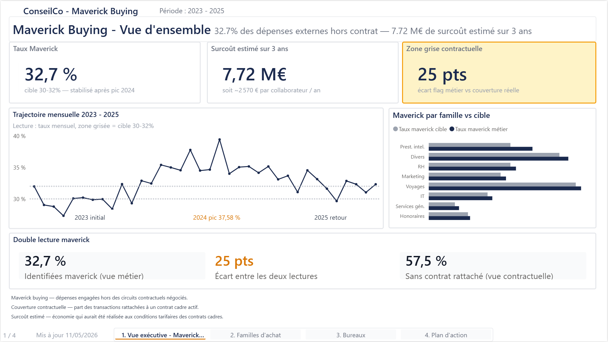
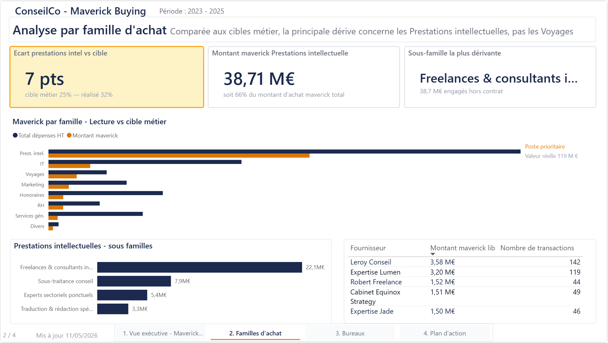
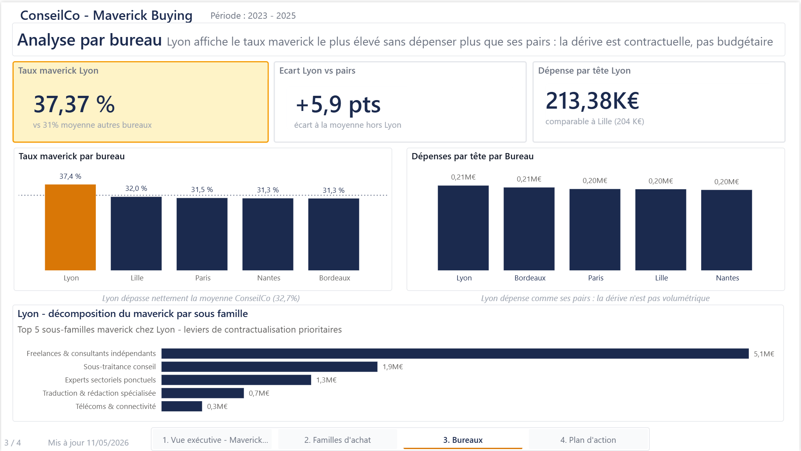
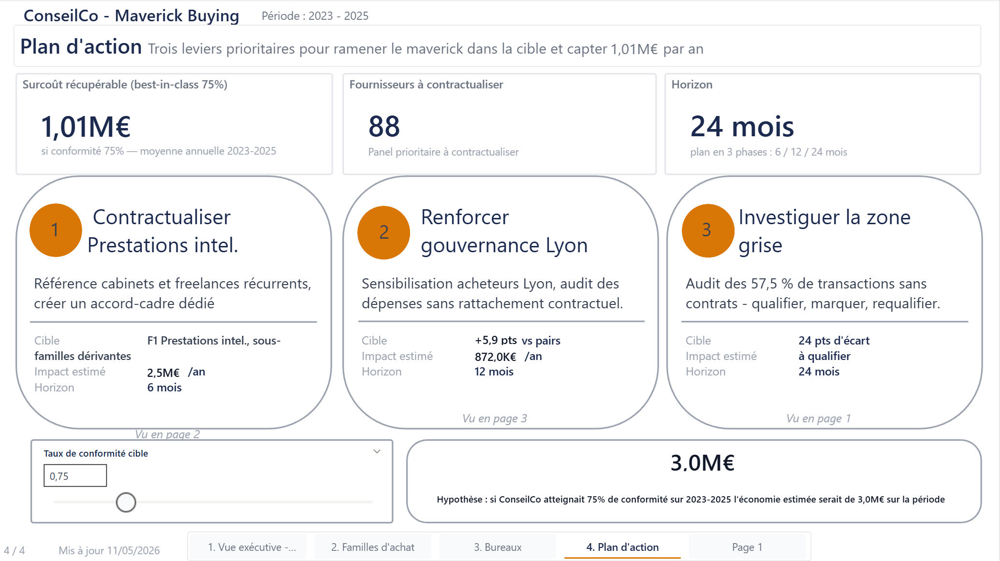
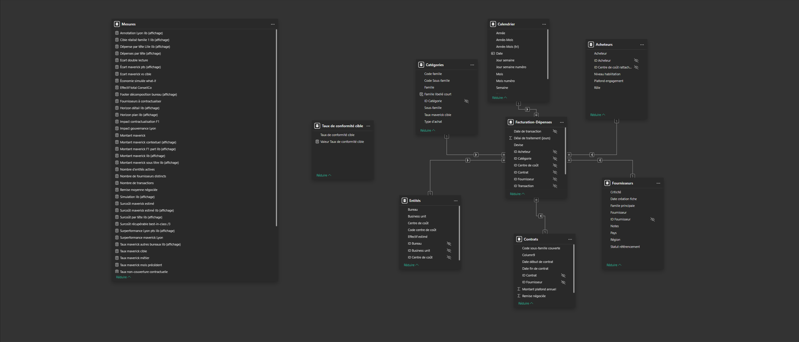

# ConseilCo — Spend Analysis & Maîtrise du Maverick Buying

> Mission BI fictive menée en posture de consultant externe.
> Cabinet de conseil ETI, 1 000 collaborateurs, 5 bureaux. Direction Achats commanditaire.
> **Objectif : quantifier et piloter le maverick buying pour générer ~2,1 M€ d'économies annuelles.**

[](https://powerbi.microsoft.com/)
[](https://www.python.org/)
[](#-mesures-dax-clés)
[](LICENSE)
[](https://learn.microsoft.com/fr-fr/credentials/certifications/data-analyst-associate/)

---

## 🎬 Démo vidéo

📺 **[Voir la démo guidée (5 min)](#)** *(lien à venir)*

> Présentation narrée du rapport, des insights métier et du raisonnement analytique.

---

## 📸 Aperçu du rapport

| Vue exécutive | Familles d'achat |
|---|---|
|  |  |
| **Bureaux** | **Plan d'action** |
|  |  |

---

## 🎯 Contexte de la mission

**ConseilCo** (cabinet de conseil fictif) — ETI (entreprise de taille intermédiaire) française de 1 000 collaborateurs, présente à Paris et dans 4 bureaux régionaux (Lyon, Bordeaux, Lille, Nantes). En forte croissance, sa Direction Achats, récemment renforcée, souhaite **professionnaliser la fonction** et **maîtriser le maverick buying** — les dépenses engagées hors des circuits contractuels.

### Problématique métier

> *« Comment donner à la Direction Achats une vision consolidée et actionnable du maverick buying, afin de réduire la part des dépenses non conformes et de sécuriser la performance achats du cabinet ? »*

### Livrable

Un rapport Power BI de 4 pages permettant à la Direction Achats de :
1. Quantifier le maverick buying (taux, volume, surcoût)
2. Identifier les zones de dérive (catégories, bureaux, fournisseurs)
3. Suivre l'évolution dans le temps
4. Simuler l'impact d'un plan de remise en conformité

---

## 💡 Insights métier clés

### 1. Le vrai angle mort, c'est F1 — pas Voyages
**Lecture brute** : Voyages affiche ~45% de maverick, le taux le plus élevé. Tentation : prioriser cette famille.
**Lecture analytique** : avec une cible de 50% (catégorie structurellement difficile à contractualiser), Voyages est **conforme à la cible**. F1 Prestations intellectuelles, à 32% mais avec une cible de 25%, présente un **écart de +7 pts** — c'est le vrai sujet.

> *« Je lis non pas la valeur absolue d'un indicateur, mais sa position par rapport à un référentiel. »*

### 2. Lyon ne dépense pas plus, il dépense moins bien
Le bureau de Lyon affiche un taux de maverick de **37,4%** contre ~31% pour les autres bureaux (+5,8 pts). Sa **dépense par tête est pourtant équivalente** à celle de Lille ou Nantes.

> *« Le problème n'est pas l'enveloppe, c'est la gouvernance. »*

### 3. Le surcoût se chiffre — l'opportunité aussi
À 32,7% de maverick global et un surcoût moyen estimé via remises contractuelles non captées, le maverick coûte ~**3 000 €/collaborateur/an** à ConseilCo. En atteignant la référence du marché (Ardent Partners — 74,9% de couverture contractuelle), l'économie simulée est de **~2,1 M€/an**.

### 4. La double lecture du maverick
Le taux « métier » (32,7%) ne raconte qu'une partie de l'histoire. **57,5%** des transactions n'ont **aucun contrat rattaché** : zone grise de **25 points** — fournisseurs référencés mais utilisés sans cadre contractuel formel. Levier d'amélioration majeur, invisible sur le seul taux maverick.

---

## 🛠️ Stack technique

| Domaine | Outils & techniques |
|---|---|
| **Génération de données** | Python 3.11 (pandas, numpy, faker) |
| **Préparation** | Power Query (langage M) — francisation, typage, dépivotage |
| **Modélisation** | Schéma en étoile, 6 dimensions + 1 fait, 30 000 transactions |
| **Calculs** | DAX (Data Analysis Expressions, langage de calcul de Power BI) — 20 mesures en 5 dossiers d'affichage |
| **Visualisation** | Power BI Desktop, charte visuelle dédiée |
| **Interactivité** | Paramètre What-if (simulateur d'économies) |

---

## 🗂️ Architecture du modèle

 *(image à venir)*

**Table de faits** : `Dépenses` (30 000 transactions sur 3 ans)
**Dimensions** :
- `Calendrier` (table de dates marquée, plage 2023-2026)
- `Catégories` (8 familles, 39 sous-familles)
- `Entités` (5 bureaux, 20 entités)
- `Acheteurs` (40 acheteurs, 4 niveaux de séniorité)
- `Fournisseurs` (200 fournisseurs, dont 6 « pirates » non référencés)
- `Contrats` (70 contrats — cadre, dédiés, zone grise)

---

## 📐 Mesures DAX clés

20 mesures organisées en 5 dossiers : Volumétrie, Maverick, Surcoût, Time intelligence, Cibles & contextuelles.

📄 **[Documentation détaillée des mesures DAX →](docs/mesures-dax.md)** *(à venir)*

**Exemples phares** :

```dax
Taux maverick métier =
DIVIDE(
    CALCULATE([Total dépenses HT], Dépenses[Flag maverick] = TRUE),
    [Total dépenses HT]
)
```

```dax
Économie simulée what-if =
VAR TauxCible = SELECTEDVALUE('Taux de conformité cible'[Taux de conformité cible])
VAR TauxMaverickActuel = [Taux maverick métier]
VAR PartConvertible = (1 - TauxMaverickActuel) - TauxCible
RETURN
    IF(
        PartConvertible > 0,
        PartConvertible * [Total dépenses HT] * [Remise moyenne négociée],
        0
    )
```

---

## 📁 Structure du repo

```
conseilco-spend-maverick-analysis/
├── README.md                  ← Vous êtes ici
├── LICENSE                    ← MIT
├── pbix/
│   └── ConseilCo_SpendAnalysis_v3.pbix
├── data/
│   ├── generate_fact_depenses_fixed.py   ← Script de génération
│   ├── dim_categories.xlsx
│   ├── dim_entites.xlsx
│   ├── dim_acheteurs.xlsx
│   ├── dim_fournisseurs.xlsx
│   ├── dim_contrats.xlsx
│   └── fact_depenses.csv
├── docs/
│   ├── cadrage-projet.md      ← Document de cadrage complet
│   ├── mesures-dax.md         ← Documentation des 20 mesures
│   ├── modele-donnees.png     ← Schéma du modèle
│   └── screenshots/           ← Captures des 4 pages
└── demo/
    └── lien-video.md          ← URL de la démo
```

---

## 🚀 Reproduire le projet

### Prérequis
- **Power BI Desktop** (version récente — gratuit)
- **Python 3.11+** *(uniquement si vous souhaitez régénérer les données)*

### Lancer le rapport
1. Cloner le repo : `git clone https://github.com/antoine-fournier19/conseilco-spend-maverick-analysis.git`
2. Ouvrir `pbix/ConseilCo_SpendAnalysis_v3.pbix` dans Power BI Desktop
3. Actualiser les sources (chemin local des fichiers Excel/CSV à ajuster)

### Régénérer le dataset
```bash
cd data/
pip install pandas numpy faker openpyxl
python generate_fact_depenses_fixed.py
```

---

## 🎓 Démarche & apprentissages

Ce projet a été mené dans une posture de **consultant BI externe** mandaté par un client. Il couvre l'ensemble du cycle PL-300 :

| Étape | Livrable |
|---|---|
| **Cadrage** | Note de cadrage, problématique en 1 phrase, KPI cibles |
| **Conception données** | Taxonomie achats (8/39), volumétrie calibrée sur benchmarks marché (Ardent Partners — cabinet d'analyse de référence sur les Achats indirects ; APQC — American Productivity & Quality Center) |
| **Génération** | Script Python paramétrable, calibration multi-niveaux (taux par famille, bureau dérivant, fournisseurs pirates) |
| **Modélisation** | Schéma en étoile, conventions de nommage, table de dates marquée |
| **Mesures DAX** | 20 mesures structurées en 5 dossiers, time intelligence, what-if |
| **Visualisation** | Charte sobre, 4 pages narratives, navigation entre pages, exploration descendante |
| **Restitution** | Vidéo démo, documentation, pitch entretien |

### Limites identifiées et assumées
- **Données 100% synthétiques** : crédibilité statistique mais pas de découverte réelle à en tirer
- **Pas de déploiement sur Power BI Service** : compte pro non disponible — vidéo démo et `.pbix` GitHub privilégiés
- **Sécurité au niveau des lignes (RLS) non mise en place** : non pertinent pour le périmètre fictif retenu

### Points méthodologiques travaillés
- **Documentation au fil de l'eau** : journal de bord, décisions tracées
- **Itération vs perfection** : 5 corrections successives sur le dataset (cf. journal des décisions)
- **Arbitrage simple vs sophistiqué** : filtre Année simple retenu après l'abandon d'une solution dynamique qui ne correspondait pas au besoin

---

## 📄 Documentation complémentaire

- 📋 **[Cadrage de mission complet](docs/cadrage-projet.md)** — contexte, problématique, journal de bord
- 📐 **[Documentation des mesures DAX](docs/mesures-dax.md)** — 20 mesures commentées *(à venir)*
- 🎬 **[Vidéo démo](#)** *(lien à venir)*

---

## 👤 Auteur

**Antoine Fournier**
Étudiant en Business Intelligence — Préparation Microsoft PL-300
Recherche d'alternance en Business Intelligence / Consulting BI

🐙 GitHub : [@antoine-fournier19](https://github.com/antoine-fournier19)

---

## 📜 Licence

Ce projet est distribué sous licence **MIT**. Voir le fichier [LICENSE](LICENSE) pour les détails.

Les données sont entièrement **fictives et synthétiques** — toute ressemblance avec une entreprise existante serait fortuite. Les benchmarks cités (Ardent Partners, APQC) sont des références publiques de l'industrie.

---

*Document mis à jour régulièrement — dernière révision : mai 2026. Projet réalisé dans le cadre de la préparation à la certification Microsoft PL-300 et de la recherche d'alternance.*
